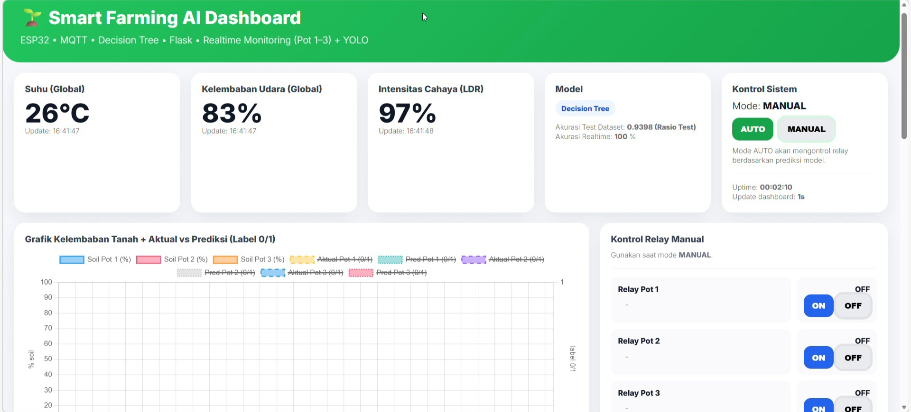
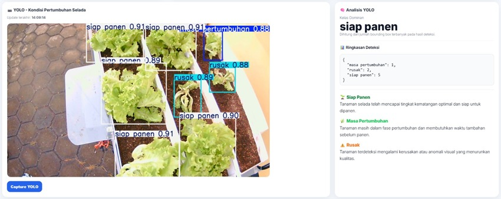

# 🌱 Smart Farming Server (YOLOv8 + IoT)

Sistem Smart Farming berbasis Computer Vision dan IoT untuk mendeteksi kondisi tanaman selada secara real-time menggunakan model YOLOv8 serta monitoring sensor melalui dashboard web.

---

## 🏗️ Arsitektur Sistem

Kamera & Sensor → ESP32 → MQTT → Backend (Flask) →  
Decision Tree & YOLOv8 → Dashboard Web

---

## 📸 Tampilan Sistem

<p align="center">
  
</p>

<p align="center">
  
</p>
---

## 🚀 Fitur Utama

### 1. Monitoring Sensor (IoT)
- Suhu
- Kelembaban
- Intensitas cahaya (LDR)
- Data ditampilkan secara real-time pada dashboard

### 2. Deteksi Kondisi Tanaman
- Growing (Sedang tumbuh)
- Ready to Harvest (Siap panen)
- Damaged (Rusak)

Menggunakan model YOLOv8 berbasis deep learning.

### 3. Dashboard Web
- Visualisasi data sensor
- Monitoring kondisi tanaman
- Integrasi dengan backend Flask

### 4. Sistem Otomatisasi
- Prediksi penyiraman menggunakan Decision Tree
- Kontrol relay berbasis hasil prediksi
- Integrasi MQTT dengan ESP32

---

## ⚙️ Teknologi yang Digunakan

- Python (Flask)
- YOLOv8 (Ultralytics)
- ESP32 (IoT)
- MQTT Protocol
- Decision Tree (Machine Learning)
- HTML, CSS, JavaScript

---

## 📂 Struktur Folder

- services/ → logic backend (YOLO, MQTT, scheduler)
- web/ → routing & dashboard
- static/ → asset frontend (termasuk gambar dashboard)
- logs/ → data sensor
- ESP32/ → kode perangkat IoT

---

## ▶️ Cara Menjalankan

Install dependency:
```bash
pip install -r requirements.txt